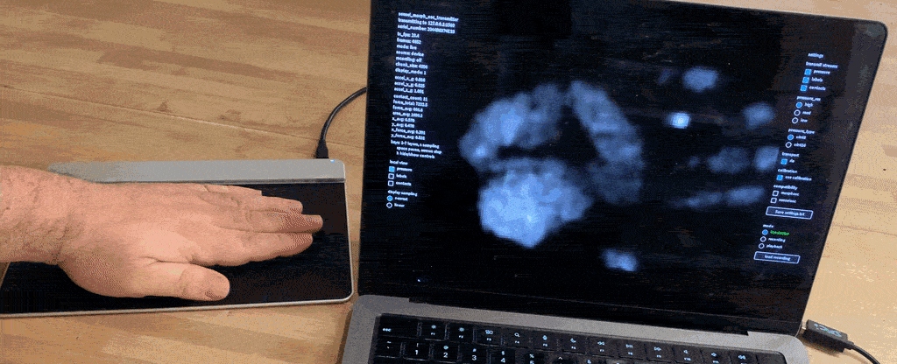
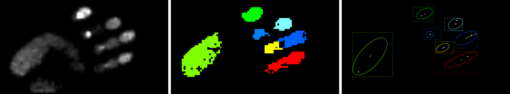
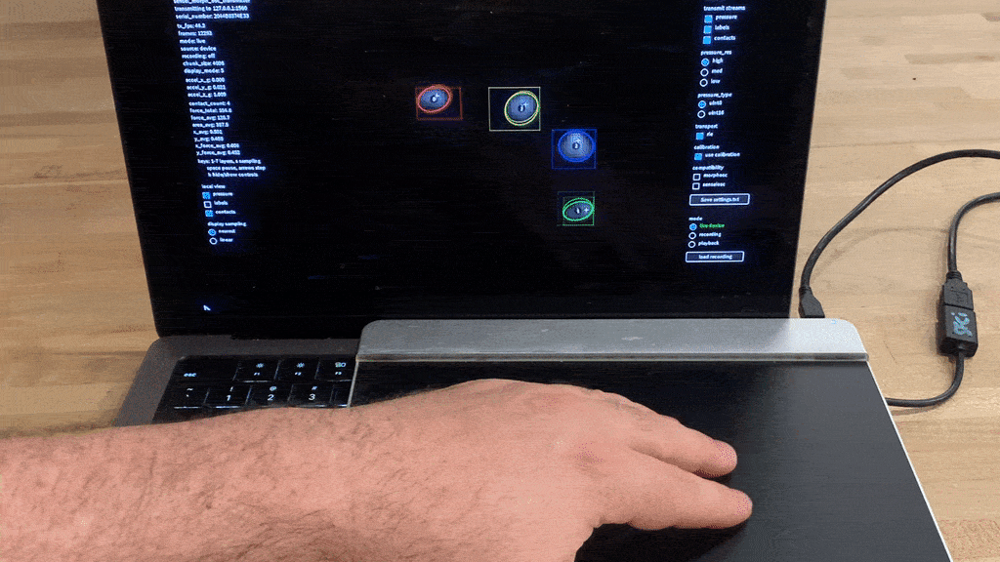
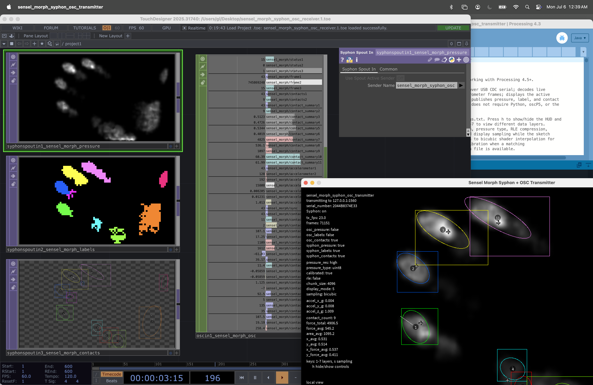
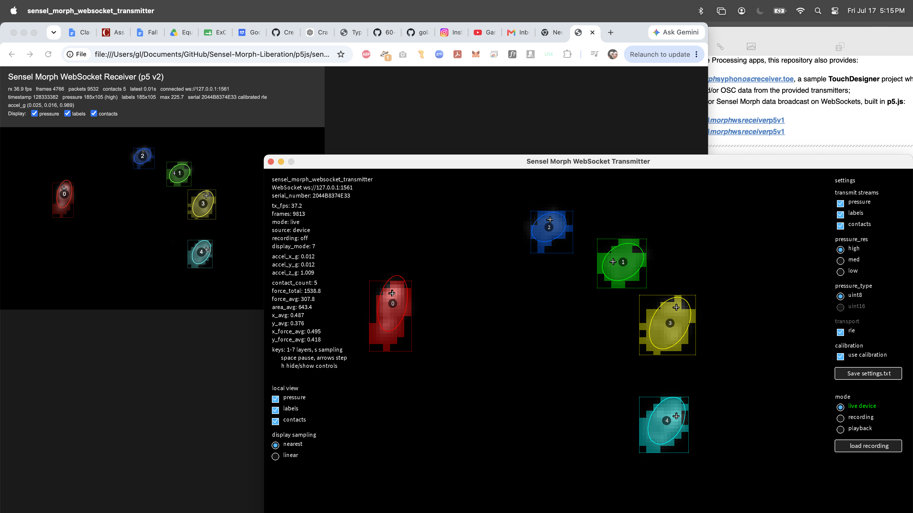
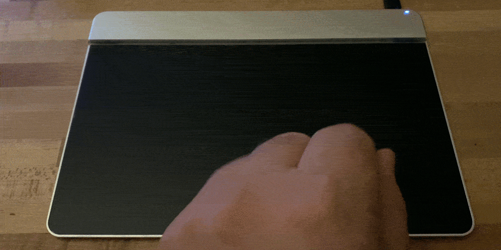

# Sensel Morph Liberation

Access and transmit complete Sensel Morph touchpad data over OSC, Syphon, or WebSockets with Processing or Python — and with no SDK dependencies. Golan Levin, July 2026

 *Image of the Sensel Morph's 185x105 pressure-image visualized in Processing*

> *This repository is the first complete open-source implementation of the Sensel Morph's raw pressure data pipeline. It restores open access to one of the most expressive pressure-imaging devices ever made after its original software stack was abandoned.*

---

## Overview

 *Image of the Sensel Morph's trio of data channels (L-R): pressure, labels, contacts. The device can also send accelerometer and other interaction data.*

The [Sensel Morph](https://guide.sensel.com/morph/) is an unusually expressive pressure-sensitive input device capable of reporting not only touches, but dense force images over its entire sensing surface. Unlike conventional multitouch devices, it can measure and report continuous pressure distributions from fingers, hands, brushes, and custom physical overlays.

Although Sensel published an [SDK](https://github.com/sensel/sensel-api), the key components required to access the Morph's raw pressure imagery [were distributed only as closed binary libraries](docs/narrative#the-problem). After official development of the SDK ceased in 2017, those libraries became increasingly difficult to use, limiting access to much of the hardware's most interesting capabilities.

This repository reconstructs those missing pieces through an open implementation of the Morph's communication protocol, pressure and label decoding, and live data bridges. It provides standalone tools for Processing and Python that communicate directly with the hardware, without depending on Sensel's SDK. The utilities in this repository will allow you to:

* access and visualize the Morph's complete sensing data, including pressure images, label images, contacts, and accelerometer data
* transmit Sensel Morph data over OSC, WebSockets, and Syphon
* record, replay, and re-transmit interaction sessions
* calibrate the device to compensate for its fixed noise patterns
* interface with p5.js, Processing, Python, TouchDesigner, etc.

Our OSC utilities preserve optional compatibility with 
[`morphosc`](https://github.com/ctsexton/morphosc) and [`senselosc`](https://github.com/tai-studio/senselosc) so that older Morph patches and tools can continue to
run against a newly liberated data source.

### Contents: 

* [Overview](#overview)
* [Processing Utilities for Sensel Morph](#processing-utilities-for-sensel-morph)
* [Python Utilities for Sensel Morph](#python-utilities-for-sensel-morph)
* [Other Documentation](#other-documentation)

---

## Processing Utilities for Sensel Morph

 *Image of Sensel Morph pressure and contacts, visualized in Processing*

[**This repository provides six standalone Processing applications**](processing/README.md) for viewing, recording, calibrating, replaying, and broadcasting Sensel Morph data. Together they offer a complete SDK-free environment for working with the device in creative coding workflows. For complete information on the Processing implementations, please see [**`processing/README.md`**](processing/README.md).

The Processing app you probably want is [**`sensel_morph_osc_transmitter`**](processing/sensel_morph_osc_transmitter/README.md), which connects directly to the Sensel Morph over USB serial, decodes live data frames, displays the pressure/label/contact layers, and emits this information over [OSC](https://en.wikipedia.org/wiki/Open_Sound_Control). However, there are also other Processing apps which transmit Sensel Morph data over [WebSockets](https://en.wikipedia.org/wiki/WebSocket) or [Syphon](https://syphon.info/), as summarized [here](processing/README.md) and in the table below. 

All apps are compatible with Processing 4.5.5, with the exception of the Syphon transmitter, which due to limits in the Syphon library is currently restricted to Processing 4.3. To minimize dependencies, all apps use the Processing's built-in Serial Library to communicate with the device, and native Java UDP code for OSC; they do not depend on `oscP5`, the original Sensel SDK, or any of the Python code in this repository.

### Summary of Processing Apps

| Processing App | Intended Use |
|---|---|
| [**sensel_morph_osc_transmitter**](processing/sensel_morph_osc_transmitter/README.md) | Standalone live USB reader and OSC broadcaster. Features local display, performance recording, and playback. | 
| [**sensel_morph_osc_receiver**](processing/sensel_morph_osc_receiver/README.md) | Live OSC monitor (receiver) and viewer. |
| [**sensel_morph_syphon_osc_transmitter**](processing/sensel_morph_syphon_osc_transmitter/README.md) | Standalone live USB reader, which transmits device data over both OSC and Syphon (for audiovisual tools like TouchDesigner). Note: compatible up to Processing 4.3 owing to the Syphon library. | 
| [**sensel_morph_websocket_transmitter**](processing/sensel_morph_websocket_transmitter/README.md) | Standalone live USB read and WebSocket transmitter (for browser-based/p5 clients). | 
| [**sensel_morph_capture_viewer**](processing/sensel_morph_capture_viewer/README.md) | Offline recording viewer. |
| [**sensel_morph_osc_calibrator**](processing/sensel_morph_osc_calibrator/README.md) | Creates optional pressure calibration files to compensate for fixed noise patterns. |

### Other Provided Apps

 *Screenshot of Processing (at right) communicating with Touchdesigner (at left) over Syphon and OSC*

In addition to the Processing apps, this repository also provides: 

* [**sensel_morph_syphon_osc_receiver.toe**](touchdesigner/sensel_morph_syphon_osc_receiver.toe), a sample **TouchDesigner** project which receives Syphon and/or OSC data from the provided transmitters; 
* Receivers for Sensel Morph data broadcast on WebSockets, built in **p5.js**:
  * [**sensel_morph_ws_receiver_p5v1**](p5js/sensel_morph_ws_receiver_p5v1/README.md)
  * [**sensel_morph_ws_receiver_p5v2**](p5js/sensel_morph_ws_receiver_p5v2/README.md)

A local server is not required to run the p5.js receiver apps. 

 *Screenshot of Processing (at right) communicating with p5.js (at left) over WebSockets.*

---

## Python Utilities for Sensel Morph

 *Image of the Sensel Morph's LEDs under interactive control*

The [Python tools](python/README.md) provided here are lightweight command-line utilities intended for scripting, automation, and software integration. They provide direct USB access to the Morph, live OSC and WebSocket bridges, recording tools, and interactive LED control, making them suitable for creative coding, rapid prototyping, and protocol research.

The Python command-line tools live in [`python/`](python/). For installation instructons, command summaries, recording examples, and notes about behavior and implementation, please see: [**`python/README.md`**](python/README.md)

### Summary of Python Tools

| Python Program | Intended Use |
|---|---|
| [`sensel_morph_osc.py`](python/tools/sensel_morph_osc.py) | Live USB reader and OSC broadcaster. |
| [`sensel_morph_ws.py`](python/tools/sensel_morph_ws.py) | Live USB reader and WebSocket broadcaster. |
| [`sensel_morph_capture_session.py`](python/tools/morph_capture_session.py) | Performance recording tool; produces JSONL/JSON. |
| [`sensel_morph_led.py`](python/tools/sensel_morph_led.py) | Controls the Morph's 24 white LEDs. |

---

## Other Documentation

This repository aims to be a definitive resource for anyone hacking the Sensel Morph in the future. To that end, more information is available in the following documents:

- [**Communications Protocol**](docs/communications_protocol.md): Information about the Sensel Morph's low-level USB CDC/register protocol, frame formats, compression, labels, contacts, accelerometer, and built-in LEDs.
- [**Implementation Details**](docs/implementation_details.md): lower-level
  notes on contact geometry, calibration application, serial-number handling,
  and contact summary semantics.
- [**Reverse Engineering Lab Notes**](docs/narrative.md): how the raw pressure, labels, contact geometry, accelerometer, calibration, and output bridges were recovered.
- [**Prior Art Survey**](docs/prior_art_survey.md): annotated technical
  bibliography of SDKs, examples, OSC bridges, decompression resources, and
  other prior work.
- [**Third Party Archive**](docs/third_party_archive/): small archival copies
  of third-party files that were important to the reverse-engineering work.

---
