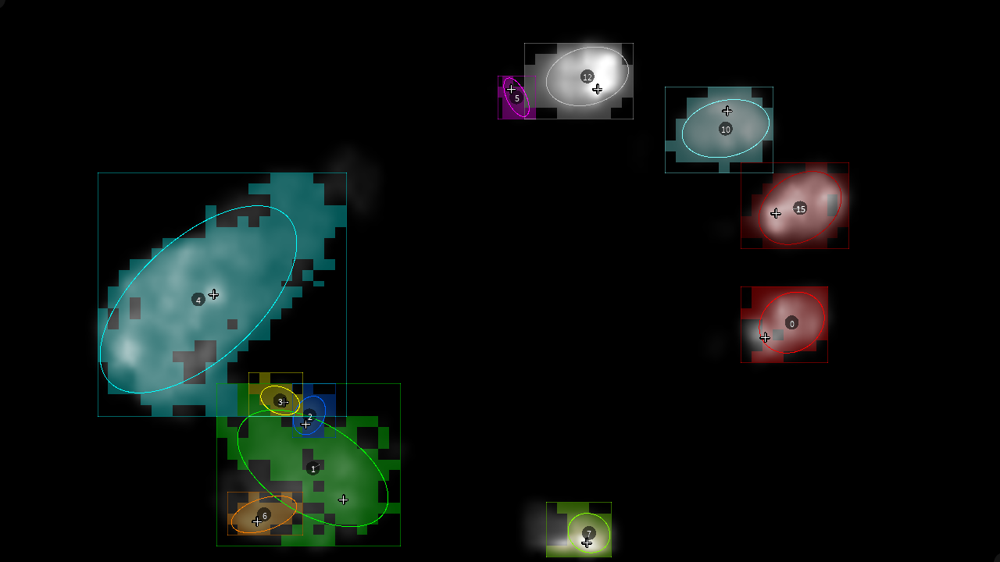
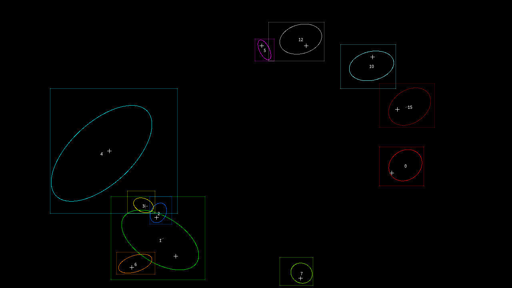
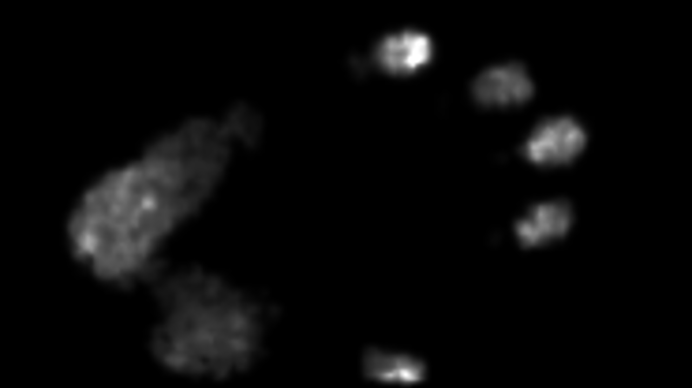
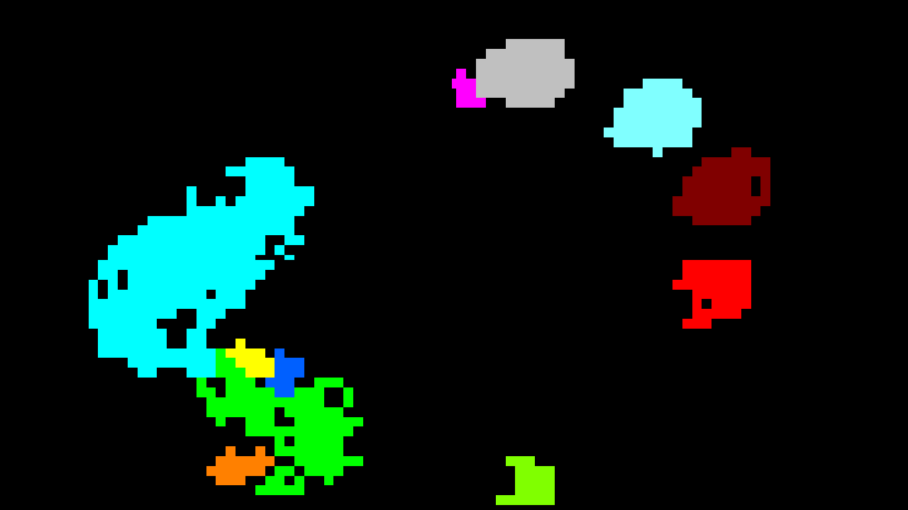

# The Sensel Morph USB Protocol

<br/>*Composite image showing successful capture of contacts, labels, and pressure information from the Sensel Morph.*

---

## Overview

**This document compiles the low-level protocol information needed to talk to a
Sensel Morph touchpad *without* the original Sensel SDK**. It explains how the device appears over USB, how its serial register protocol is framed, which registers have been
confirmed, how live frames are structured, and how pressure, labels, contacts,
accelerometer values, and LEDs are represented.

The intended reader is someone building or maintaining alternate Morph tools:
tools like Python transmitters, Processing sketches, p5.js receivers, 
Max/TouchDesigner bridges, or other creative-coding integrations. The goal is 
practical: show what bytes to send, what bytes come back, and what assumptions 
our current tools make.

This information was obtained through a mix of live-device probing, serial
captures, comparison with Sensel's public SDK examples, and disassembly
work regarding Sensel's decompression code. The notes below are empirical protocol
notes, not an official Sensel specification; where behavior has only been tested
on one device, that is stated explicitly.

These notes are measured against Morph serial number `2044B8374E33` on macOS.
The transport used here is the USB CDC (Communications Device Class) ACM (Abstract Control Model) serial device:
`/dev/cu.usbmodem2044B8374E331`.

---

## USB Enumeration

This section describes how the Morph identifies itself to the operating system.
It is useful when choosing the right transport path: the device exposes HID
interfaces, but our raw data work uses the USB CDC serial interface.

- VID:PID: `2c2f:0003`
- Product: `Sensel Morph`
- Manufacturer: `Sensel`
- USB device version: `2.00`
- Speed: full speed, 12 Mbps
- Configuration count: `1`
- Max power: `500 mA`
- CDC serial node: `/dev/cu.usbmodem2044B8374E331`
- Alternate macOS tty node: `/dev/tty.usbmodem2044B8374E331`
- macOS HID services start for Trackpad, PTP, and Digitizer.
- `MIDIServer` takes exclusive ownership of the composite USB device, which
  explains Chrome/WebUSB-style failures but does not prevent CDC serial access.

Observed USB interfaces and endpoints:

| Interface | Class / subclass / protocol | Purpose | Endpoint(s) |
|---:|---|---|---|
| `0` | `0x02 / 0x02 / 0x01` | CDC ACM control | `0x81` IN interrupt, max packet `8`, interval `255` |
| `1` | `0x0a / 0x00 / 0x00` | CDC ACM data | `0x02` OUT bulk, max packet `64`; `0x82` IN bulk, max packet `64` |
| `2` | `0x03 / 0x01 / 0x02` | HID boot mouse / trackpad | `0x83` IN interrupt, max packet `19`, interval `1` |
| `3` | `0x01 / 0x03 / 0x00` | USB MIDI | `0x04` OUT bulk, max packet `64`; `0x84` IN bulk, max packet `64` |
| `4` | `0x03 / 0x00 / 0x00` | HID digitizer | `0x85` IN interrupt, max packet `32`, interval `1` |
| `5` | `0x03 / 0x00 / 0x00` | HID PTP / touch reports | `0x86` IN interrupt, max packet `64`, interval `1` |

Passive reads from the CDC serial device produce no unsolicited bytes; the
device responds when the host sends register commands.


---

## Serial Register Framing

The Morph's useful control/data path is a small request-response register
protocol over USB serial. The host sends register read/write commands, and the
device replies with an acknowledgement, payload size, payload bytes, and a simple
checksum.

Fixed register read:

```text
host -> device: 81 <reg> <size>
device -> host: 01 <reg> <size_le16> <payload> <checksum>
```

Fixed register write:

```text
host -> device: 01 <reg> <size> <payload> <checksum>
device -> host: 05 <reg>
```

Variable-size register read:

```text
host -> device: 81 <reg> 00
device -> host: 03 <reg> 00 <size_le16> <payload> <checksum>
```

The checksum is the low 8 bits of the payload byte sum.

---

## Confirmed Registers

These are register addresses we have successfully read from the device and
interpreted enough to use safely. They are the practical map used by the capture,
OSC, WebSocket, LED, and Processing tools in this repository.

All reads below returned valid acknowledgements and checksums.

| Register | Address | Value |
|---|---:|---|
| Magic | `0x00` | `S3NS31` (i.e. "sensel") |
| Firmware protocol | `0x06` | `1` |
| Firmware version | `0x07..0x0b` | `0.16.78 release 1` |
| Device ID | `0x0c` | `3` |
| Device revision | `0x0e` | `1` |
| Sensor columns | `0x10` | `185` |
| Sensor rows | `0x12` | `105` |
| Active width | `0x14` | `230000 um` |
| Active height | `0x18` | `130000 um` |
| Scan frame rate | `0x20` | `2000` |
| Scan buffer control | `0x22` | `0` |
| Scan detail control | `0x23` | `1` / medium |
| Frame content control | `0x24` | `0x07` |
| Scan enabled | `0x25` | `0` |
| Supported frame content | `0x28` | `0x0f` |
| Max contacts | `0x40` | `16` |
| LED brightness array | `0x80` | variable-size writable array |
| LED brightness element size | `0x81` | query before writing |
| LED brightness max | `0x82` | query before writing |
| LED count | `0x84` | Morph strip is documented as 24 white LEDs |
| Unit shift dims | `0xa0` | `8` |
| Unit shift force | `0xa1` | `3` |
| Unit shift area | `0xa2` | `0` |
| Unit shift angle | `0xa3` | `4` |
| Unit shift time | `0xa4` | `0` |
| Error code | `0xec` | `0` |

Frame-content bits from the SDK:

- `0x01`: pressure
- `0x02`: labels
- `0x04`: contacts
- `0x08`: accelerometer


---

## Variable-Size Registers

Some registers return or accept payloads larger than the fixed one- or two-byte
values above. These are used for strings, decompression metadata, LED arrays, and
other data where the register command first reports a payload length.

Device serial number register `0x0f`:

```text
03 0f 00 10 00 53 4d 30 31 31 36 34 39 31 30 33 36 38 ff ff ff d4
```

Payload decodes as `SM01164910368` followed by three `ff` bytes.

Compression metadata register `0x1c` depends on scan detail:

| Detail | Metadata payload |
|---|---|
| medium, register value `1` | `00 00 2f 1b 04 04` |
| high, register value `0` | `00 00 5d 35 02 02` |

The SDK passes this metadata into the missing `senselDecompressionTriggerDetailChange`
routine.


---

## Contact-Related Defaults



"**Contacts**" are the firmware's higher-level interpretation of pressure blobs:
fingertip/palm-like records with IDs, centers, ellipses, boxes, peaks, and movement
deltas. This section explains the default thresholds and optional fields that
control what appears in a contact packet.

These values were read from the real Sensel Morph over CDC serial without writing any
registers:

| Register | Name | Size | Raw | Value | Interpretation |
|---:|---|---:|---|---:|---|
| `0x41` | `CONTACTS_ENABLE_BLOB_MERGE` | 1 | `01` | `1` | firmware contact/blob merging enabled |
| `0x47` | `CONTACTS_MIN_FORCE` | 2 | `18 00` | `24` | minimum force for contact/label creation |
| `0x4b` | `CONTACTS_MASK` | 1 | `01` | `1` | contact packets include ellipse fields |
| `0xa1` | `UNIT_SHIFT_FORCE` | 1 | `03` | `3` | force values divide by `2^3 = 8` in SDK units |
| `0xa2` | `UNIT_SHIFT_AREA` | 1 | `00` | `0` | area values are unshifted |

`CONTACTS_MIN_FORCE` is the likely documented knob for changing when firmware
promotes pressure into labeled contacts. The safe experimental sequence would
be to read and save the original value, stop scanning, write a temporary value,
capture a short recording, and restore the original value. We have not modified
these registers; the captured data reflects firmware defaults.

Contact mask register `0x4b` controls optional fields appended to every contact
record:

| Bit | SDK name | Bytes/contact | Fields |
|---:|---|---:|---|
| `0x01` | `CONTACT_MASK_ELLIPSE` | 6 | `orientation`, `major_axis`, `minor_axis` |
| `0x02` | `CONTACT_MASK_DELTAS` | 8 | `delta_x`, `delta_y`, `delta_force`, `delta_area` |
| `0x04` | `CONTACT_MASK_BOUNDING_BOX` | 8 | `min_x`, `min_y`, `max_x`, `max_y` |
| `0x08` | `CONTACT_MASK_PEAK` | 6 | `peak_x`, `peak_y`, `peak_force` |

The contact center, ellipse axes, deltas, and bounding-box coordinates use
Sensel's `dims_value_scale` fixed-point convention (`raw / 256`). Empirically,
`peak_x` and `peak_y` are an exception: in full `0x0f` captures they are whole
millimeter-like active-area coordinates. Dividing peak coordinates by `256`
places crosshairs near the canvas origin.

The SDK commonly requests all optional contact fields with mask `0x0f`.
`sensel_morph_osc` follows that behavior while running with `--contacts`, then
restores the prior register value when it exits. Raw JSON captures preserve the
firmware contact packet literally.

In practice, we discovered that the contact ellipses returned by the Sensel 
Morph's firmware *lagged behind the true location of fingertips* in the current 
pressure image — by one frame (i.e. roughly ~1/30 sec). For this reason, when
the pressure image is available (i.e. enabled), we use it to help calculate our 
*own ellipses*. 

Specifically: in live OSC/WS output with pressure, labels, and contacts enabled,
`sensel_morph_osc` replaces the firmware's contact ellipses with current-frame
raster-derived ellipses. We compute pressure-weighted second moments inside
each contact's label blob on the decoded raw pressure grid, then emits the
centroid plus an oriented ellipse with axes `4 * sqrt(covariance eigenvalue)`.
This avoids the observed one-frame lag in the firmware's ellipse fields.

When the pressure image is not enabled, then runs of the software which exclusively 
request contact information will still fall back to emitting the firmware's (laggy) 
geometry. This is done to avoid the speed penalty of accessing the pressure image.
Note that the same live path also replaces the firmware peak estimate with the brightest 
pressure cell inside the label blob before uint8 clipping.

Native OSC additionally sends `/sensel_morph/contact_summary` once per contact
frame:

```text
frame_id count x_avg y_avg x_force_avg y_force_avg force_total force_avg area_avg spread avg_weighted_distance
```

The summary center fields are normalized to `0..1`; `spread` and
`avg_weighted_distance` remain millimeter distances. The summary is derived from
the same contact centers used for `/sensel_morph/contact`, so it uses fresh
raster-derived centers when pressure and labels are present, and firmware
centers otherwise. Compatibility OSC outputs keep their original millimeter
coordinate ranges.

Ellipse display convention: Sensel's public Processing/openFrameworks examples
rotate by `orientation`, then draw `minor_axis` as local X width and
`major_axis` as local Y height. The packet fields are still parsed literally;
this is a rendering convention.


---

## Frame Read

Live sensor data is delivered by repeatedly asking the scan-read register for
one frame. Each frame starts with a content mask, so readers know which sections
are present and how to parse the rest of the payload.

Frame read command:

```text
host -> device: 81 26 00
device -> host: 03 26 00 <payload_size_le16> <payload> <checksum>
```

The frame payload begins:

```text
<content_mask> <rolling_counter> <timestamp_le32> <content sections...>
```

The SDK parses content sections in this order:

1. contacts, if `content_mask & 0x04`
2. accelerometer, if `content_mask & 0x08`
3. compressed pressure/labels, if `content_mask & 0x03`

Accelerometer section format:

```text
s16_le x_accel
s16_le y_accel
s16_le z_accel
```

The values are signed 16-bit little-endian counts. In the accelerometer-only
captures, the rest magnitude is roughly `15500..16000` counts, so `15600`
counts per g is the current working scale. With the Morph lying approximately
flat, positive local Z points up. Accelerometer data gives roll/pitch relative
to gravity, but cannot determine yaw around gravity.

With `frame_content_control=0x07` at medium detail, one captured frame had:

- payload size: `54`
- content mask: `0x07`
- checksum: valid
- one contact section
- remaining pressure/label compressed bytes: `30`

With high detail and pressure-only content (`scan_detail=0`,
`frame_content_control=0x01`), a 40-frame burst was captured. Payload sizes
were variable and compact: `9`, `16`, `17`, `25`, `26`, `36`, `38`, `39`,
`41`, `42`, `45`, and `47` bytes in this run. All checksums were valid.


---

## HID Access Test

The Morph also exposes HID interfaces, which might look tempting for raw data
access. Our tests found that HID could be opened from the normal local process,
but did not yield useful reports, so CDC serial remains the reliable path for
pressure frames.

In our restricted revers-engineering environment, hidapi enumeration worked 
but `open_path` failed for all Sensel HID collections.

From the normal local process, hidapi successfully opened one path per HID
interface:

- interface `2`, usage page `1`, usage `2`
- interface `4`, usage page `13`, usage `2`
- interface `5`, usage page `1`, usage `2`

Polling those opened HID handles for 10 seconds returned zero input reports.
So the current result is narrower than "macOS owns HID": direct open is possible
from a normal local process, but hidapi did not receive reports in this test.

The CDC serial path remains the useful raw-frame path because it can request
compressed pressure frames through documented register commands.


---

## Pressure Compression



Raw pressure frames are compact because the Morph does not transmit all
`185 x 105` pressure pixels directly. Instead, it sends a compressed lower-grid
image and metadata that tells the decoder how to expand it back to sensor size.

Status: recovered from `LibSenselDecompress.dll` and validated against the
pressure-only captures in `captures/pressure/`.

Pressure frame bytes after the 6-byte frame header are a low-resolution pressure
image encoded with a small custom RLE. It is compressed, but it is not encrypted.

The compression metadata register describes the low-resolution grid:

| Detail | Metadata payload | Low-res grid | Scale to sensor grid |
|---|---|---:|---:|
| medium, register value `1` | `00 00 2f 1b 04 04` | `47 x 27` | `4 x 4` |
| high, register value `0` | `00 00 5d 35 02 02` | `93 x 53` | `2 x 2` |

The compressed pressure body uses 7/14-bit unsigned varints:

```text
if first_byte & 0x80:
    value = (first_byte & 0x7f) | (second_byte << 7)
else:
    value = first_byte
```

The first varint is a per-frame base value. The stream then alternates between
zero-run mode and value mode:

1. Start in zero-run mode.
2. In zero-run mode, read varint `n`, emit `n` zero cells, then switch to value
   mode.
3. In value mode, read varint `v`.
4. If `v != 0`, emit one nonzero cell with value `base + v` and remain in value
   mode.
5. If `v == 0`, emit nothing and switch back to zero-run mode.
6. Decoding is complete only when exactly `cols * rows` cells have been emitted
   and all compressed bytes have been consumed.

Example: the quiet baseline body `03 f5 09` decodes as base `3` followed by one
zero run of `1269` cells, which exactly fills the medium `47 x 27` grid.

`python/tools/decode_pressure.py` implements this decoder. It decoded every
pressure-only capture with zero failures and produced physically plausible
centroids for the recorded gestures:

- top-left hold: about `(8, 6)` on the high `93 x 53` grid
- top-right hold: about `(87, 5)`
- bottom-left hold: about `(4, 48)`
- bottom-right hold: about `(87, 46)`
- left-to-right sweep: about `x = 8..90`

One caveat: the earliest pressure captures requested high detail and read high
compression metadata, but the compressed stream itself decoded as the medium
`47 x 27` grid. Later captures decoded as high detail. A robust reader should
therefore infer or validate the grid against each stream, not blindly trust the
last-read metadata.

This caveat matters more when pressure and labels are requested together. The
label stream follows the pressure stream in the same compressed byte body, so a
wrong fallback pressure grid can appear to decode successfully while leaving the
reader at the wrong byte offset for labels. In mixed pressure+label frames,
prefer the current compression metadata first and treat fallback grids as
validated only if the following label stream also decodes cleanly.

The decompressor then expands the low-resolution pressure grid with separable
four-tap interpolation weights built from the metadata scale factors. The output
size is:

```text
out_cols = (compressed_cols - 1) * x_scale + 1
out_rows = (compressed_rows - 1) * y_scale + 1
```

For high detail, this is `(93 - 1) * 2 + 1 = 185` columns and
`(53 - 1) * 2 + 1 = 105` rows, matching the Morph sensor dimensions.

The DLL stores decompressed pressure as `(base + delta) / force_value_scale`.
This device reports `UNIT_SHIFT_FORCE = 3`, so SDK-style force values are raw
RLE pressure values divided by `8`. The analysis tool keeps raw units unless
`--force-scale 8` is passed.


---

## Label Compression



Label frames identify which low-resolution pressure cells belong to the same
firmware contact region. They use a separate run-length encoding from pressure:
still compact and byte-oriented, but optimized for repeated label IDs rather
than repeated force values.

Labels use the same 7/14-bit unsigned varint format for run lengths as pressure
compression. The stream begins in null-label mode:

1. Read a run length.
2. If in null-label mode, emit that many `255` cells and switch to non-null
   mode.
3. Otherwise read one label byte and emit `label_byte & 0x7f` for the run
   length.
4. If `label_byte < 0x80`, switch to null-label mode for the next run.
5. If `label_byte >= 0x80`, remain in non-null mode for the next run.

The value `255` means "no label" or background. Non-null label values are small
contact IDs used to associate pressure cells with firmware contacts. This
decoder has been validated against the current pressure+labels capture set.

For display and interchange, labels should usually be expanded with
nearest-neighbor sampling rather than linear or cubic interpolation. Label IDs
are categorical regions, not scalar intensity values, so interpolation creates
fictional intermediate IDs.
