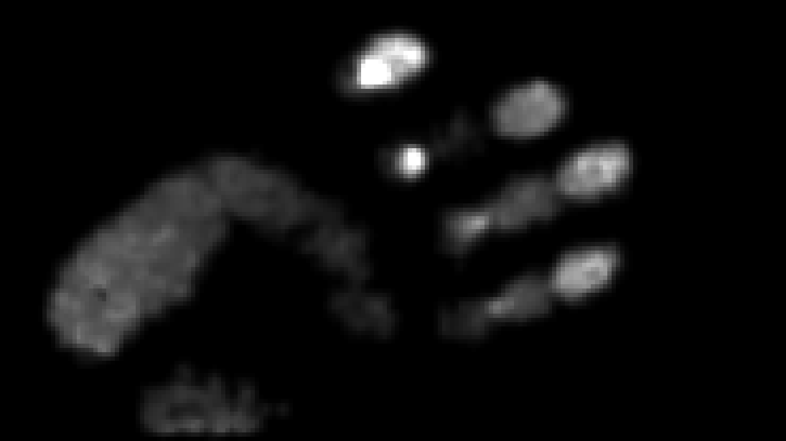
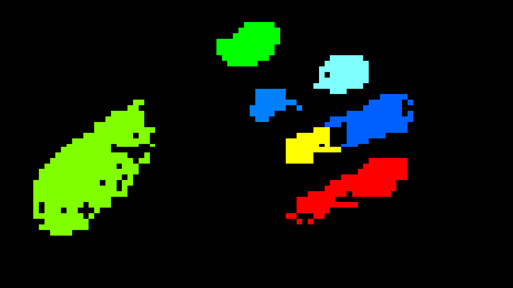
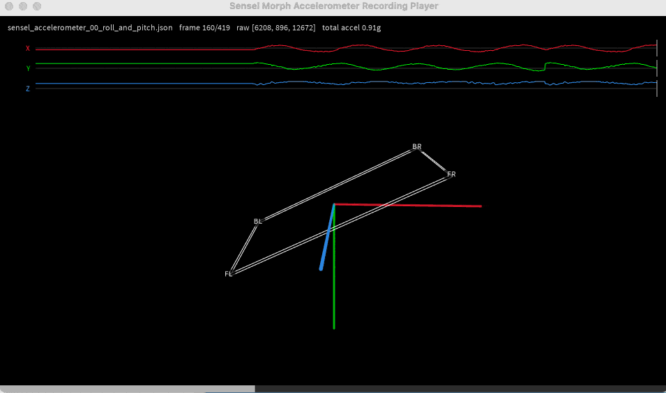

# Recovery of the Sensel Morph Data: Lab Notes

---

## Overview

This document narrates how we recovered the Sensel Morph's raw pressure and label data without Sensel's closed SDK library. The lower-level details of this effort live in
[communications_protocol.md](communications_protocol.md), and the prior-art
references live in [prior_art_survey.md](prior_art_survey.md). This document is
a readable version summarizing what we were looking for, what clues mattered, where the
dead ends were, and how the current tools came together.

The short version is this: the Sensel Morph was always capable of producing a
dense pressure image, but the public source code did not include the
decompressor needed to read it. The device sends compressed pressure and label
frames over USB CDC serial. The stream is compressed, not encrypted. By combining
the public SDK, third-party code, controlled recordings from a real Morph, and
disassembly of Sensel's Windows decompression DLL, we recovered the pressure
codec, the label codec, the frame layout, and enough of the contact pipeline to
build live OSC, WebSocket, Processing, p5.js, and Syphon tools.

#### Contents: 

* [Starting Point](#starting-point)
* [Breadcrumbs From Prior Work](#breadcrumbs-from-prior-work)
* [Probing the Real Device](#probing-the-real-device)
* [Disassembling the Decompressor](#disassembling-the-decompressor)
* [The Pressure Codec](#the-pressure-codec)
* [The Labels Image](#the-labels-image)
* [Contacts, and the One-Frame Lag](#contacts-and-the-one-frame-lag)
* [Accelerometer and Other Side Channels](#accelerometer-and-other-side-channels)
* [Calibration: Compensating for Fixed-Pattern Noise](#calibration-compensating-for-fixed-pattern-noise)
* [Side Quest: Controlling Device LEDs](#side-quest-controlling-device-leds)
* [Output Tools](#output-tools)
* [Conclusion](#conclusion)

---

## Starting Point

The Morph exposes the usual user-facing HID behavior on macOS, but HID was not
the path to raw frames. The useful path is USB CDC ACM serial: the device appears
as a `/dev/cu.usbmodem*` serial node and speaks a small register protocol. The
public SDK and Arduino sources showed enough of that protocol to get started:
read commands begin with `0x81`, write commands begin with `0x01`, variable-size
reads report a payload length, and live frames are obtained by repeatedly
reading the scan-frame register.

The first goal was not to make a nicer touchpad. The real target was the full
force image: `185 x 105` pressure pixels. The Morph's firmware also reports
contacts, which are useful ellipses and IDs for fingertips or palms, but those
are interpretations of the surface. The interesting data is the pressure field
itself.

On the test device, serial number `2044B8374E33`, the basic facts were:

- USB VID:PID `2c2f:0003`
- sensor size `185 x 105`
- active area `230 x 130 mm`
- supported frame content mask `0x0f`
- pressure bit `0x01`
- labels bit `0x02`
- contacts bit `0x04`
- accelerometer bit `0x08`

One early wrong assumption was that macOS might "own" the HID interfaces in a
way that prevented direct access. That assumption turned out to be too simple. HID handles
could be opened from a normal local process, but polling them did not yield
useful raw pressure reports. The CDC serial path remained the practical route.

---

## Breadcrumbs From Prior Work

The public Sensel code was both helpful and frustrating: the official
`sensel-api` source contains register names, frame-content masks, contact
parsing, unit shifts, and the overall frame reader. It also makes the missing
piece very clear: pressure and labels are handed to `senselDecompressFrame(...)`,
but the decompressor implementation is not present in the public source.

Other projects filled in context rather than solving the central problem. The
Arduino API provided a compact independent implementation of the same serial
register protocol. Sensel's Morph documentation confirmed the intended
semantics: force arrays, labels, contact IDs, scan detail, and the `185 x 105`
surface size. Older creative-coding projects such as `morphosc` and `senselosc`
showed how people had historically wrapped the official API, extending it with the ability to communicate its contact ellipses over OSC. Those projects matter because this repo preserves compatibility with
their OSC styles, but they did not publish an open-source decompressor for the Morph's raw pressure or label frames.

The most important third-party clue came from Sensel's own Pure Data objects. That package included `sensel_decompress.h` and Windows binary libraries:

```text
docs/third_party_archive/decompression_resources/sensel_decompress.h
docs/third_party_archive/decompression_resources/LibSenselDecompress.dll
docs/third_party_archive/decompression_resources/LibSenselDecompress.lib
```

The header named the missing decompression functions; the DLL gave us something
to inspect.

---

## Probing the Real Device

Before trusting any binary archaeology, we made the device talk. The capture
tools opened the USB CDC serial device, read identifying registers, selected
frame-content bits, enabled scanning, and repeatedly asked the frame register
for one packet at a time. The captures were intentionally simple: no touch,
corner touches, one-finger sweeps, pressure ramps, ten fingers, palms, labels,
contacts, accelerometer rotations, and stress tests with blobs merging and
splitting.

Those recordings served two purposes. First, they showed that the serial
framing and checksums were understood. Second, they made the later decoder
testable. If a "top-left hold" decoded to the bottom right of the sensor, we
would know the parser was only accidentally accepting bytes. Controlled gestures
gave us physical ground truth.

The frame payloads begin with a compact header:

```text
<content_mask> <rolling_counter> <timestamp_le32> <content sections...>
```

From there, the device includes sections for contacts, accelerometer, and
compressed pressure/labels depending on the content mask. Pressure-only frames
start their compressed body immediately after the six-byte frame header. Mixed
pressure+label frames put label data after pressure data, so the pressure
decoder must consume exactly the right number of bytes or label parsing starts
at the wrong offset.

Frame rate was also revealing. With no touch, pressure-only frames can be tiny
and very fast. Complex pressure fields produce larger compressed payloads and
slow down. This supported the hypothesis that Sensel used a plain compression
scheme for bandwidth, not obfuscation.

---

## Disassembling the Decompressor

The decompression DLL was a PE32+ x86-64 Windows binary. It had only a few
interesting exports:

```text
senselInitDecompressionHandle
senselDecompressionTriggerDetailChange
senselDecompressFrame
senselFreeDecompressionHandle
```

Simple inspection already gave useful negative evidence. The DLL did not import
zlib, LZ4, LZW, or other obvious compression libraries. It imported mundane
runtime functions such as `malloc`, `free`, and `memset`. That suggested a small custom codec, likely written to solve one problem: ship sparse pressure grids without sending `185 * 105 * 16` bits at a high frame rate.

Some of the useful commands were:

```sh
objdump -p docs/third_party_archive/decompression_resources/LibSenselDecompress.dll
objdump -d -Mintel docs/third_party_archive/decompression_resources/LibSenselDecompress.dll
objdump -s -j .rdata docs/third_party_archive/decompression_resources/LibSenselDecompress.dll
strings docs/third_party_archive/decompression_resources/LibSenselDecompress.dll
```

The `strings` output even exposed a build path:

```text
C:\Users\Sensel\sensel-api-v2\Windows\x64\Pressure-Release\LibSenselDecompress.pdb
```

The decompressor had two key responsibilities. One path handled the scan-detail
metadata. The other decoded each compressed pressure or label stream.

The scan-detail metadata lives in register `0x1c`. In high detail, the metadata
reports a `93 x 53` compressed grid with scale factors `2 x 2`. In medium
detail, it reports a `47 x 27` grid with scale factors `4 x 4`:

```text
high:   00 00 5d 35 02 02
medium: 00 00 2f 1b 04 04
```

The size math is a good sanity check. High detail expands as:

```text
(93 - 1) * 2 + 1 = 185
(53 - 1) * 2 + 1 = 105
```

The decompressor does not merely nearest-neighbor those pixels. It builds
separable four-tap interpolation weights from the scale factors and expands the
low-resolution pressure grid into the full force image. Recovering that detail
was important for making the image look like Sensel's own output rather than a
blocky approximation.

---

## The Pressure Codec



The pressure stream is a small custom run-length encoding over the compressed
grid. Values are stored as 7/14-bit unsigned varints:

```text
if first_byte & 0x80:
    value = (first_byte & 0x7f) | (second_byte << 7)
else:
    value = first_byte
```

The first varint in a pressure body is a frame-local base value. After that, the
stream alternates between zero-run mode and value mode:

1. Start in zero-run mode.
2. In zero-run mode, read a varint `n` and emit `n` zero cells.
3. Switch to value mode.
4. In value mode, read a varint `v`.
5. If `v != 0`, emit one nonzero cell with value `base + v` and remain in value
   mode.
6. If `v == 0`, emit nothing and switch back to zero-run mode.
7. A frame is valid only when it emits exactly `cols * rows` cells and consumes
   all bytes.

The quiet baseline body `03 f5 09` is a compact example. It decodes as base `3`,
then a zero run of `1269` cells. Since `47 * 27 = 1269`, that exactly fills a
medium-detail pressure grid with zeros. That detail is tiny but satisfying: the whole "image" of an untouched Morph surface can fit in three bytes.

---

## The Labels Image



Labels are separate from pressure. They are categorical IDs, not intensity
values, and they use their own run-length encoder. The background label returned by the device is `255`. Non-background labels are small contact IDs that associate regions of pressure with firmware-detected contact zones. In images like the one shown above, we have recolored these IDs with a custom palette. Label buffers should be rendered with nearest-neighbor sampling.

Label decoding starts in null-label mode. Run lengths use the same varint
format as pressure. In non-null mode, a run length is followed by a label byte:
`label_byte & 0x7f` is the label ID, and the high bit determines whether the
next run remains non-null or returns to background.

The Sensel Morph's label stream gives a clean segmentation mask for each contact, which made it possible to improve the firmware contact geometry.

---

## Contacts, and the One-Frame Lag

The Morph firmware reports contacts: IDs, states, centers, forces, areas,
ellipses, deltas, bounding boxes, and peak-force positions, depending on the
contact mask. This is useful data, and it is the layer most older Morph tools
used.

But while comparing pressure, labels, and contacts in the Processing playback
tools, a problem became obvious: the firmware ellipses were one frame stale. On
fast-moving fingers, the ellipse followed the pressure blob rather than sitting
on top of it. The lag was exactly one frame, not a vague display problem. We
left the playback sketch literal so recorded firmware lag remains visible.

For live output, though, there was no reason to preserve bad geometry when the
fresh raster data was available. The current OSC and WebSocket transmitters
compute their own contact geometry when pressure, labels, and contacts are all
enabled. For each label blob, they compute pressure-weighted second moments over
the current pressure image, then emit a centroid and oriented ellipse. The axes
are derived from the covariance eigenvalues:

```text
axis = 4 * sqrt(eigenvalue)
```

This produced ellipses that were not only current-frame, but visually better
than the firmware ellipses. The same live path also replaces the firmware peak
coordinate with the brightest pressure cell inside the label blob, using the
higher-resolution pressure values before any uint8 clipping.

The fallback is still pragmatic. Contacts-only output stays lightweight and uses
the (laggy) firmware contact geometry. Fresh ellipses require pressure and labels, 
and requesting those streams has a speed cost.

---

## Accelerometer and Other Side Channels



The accelerometer was a smaller discovery, but still useful. The Morph can
report signed little-endian X/Y/Z acceleration counts. Rest magnitude is roughly
`15500..16000` counts, so the tools use about `15600` counts per g. A Processing
player renders the device as a thin slab, using the measured gravity
vector for roll and pitch. Yaw is intentionally not inferred from the
accelerometer, because there is no compass.

---

## Calibration: Compensating for Fixed-Pattern Noise

Once pressure images were visible, another sensor reality appeared: the Morph's
pressure pixels are not perfectly uniform. Some regions are consistently a
little bright or dark regardless of the hand motion above them. This looks like
the pressure equivalent of fixed-pattern noise or photo-response non-uniformity
in cameras.

The calibrator borrows the camera flat-field idea:

```text
corrected = max(0, raw - dark) * gain
gain[pixel] = target / measured_response[pixel]
```

For a camera, the flat field is uniform illumination. For the Morph, we used a
wide paintbrush dragged across the surface as a practical substitute for an even
pressure field. The Processing calibrator records a no-touch dark map, then up
to nine brush-pass maxima. It aggregates covered pixels with a robust middle
subset, saves 16-bit TIFFs and float maps, and writes
`calibration_<serial>.json`.

The live Python transmitter validates calibration files against the connected
USB serial number before applying them. Later, the correction was made
kernel-aware: instead of blindly multiplying the expanded `185 x 105` image,
the calibration fitting can push information back through the same Sensel
four-tap reconstruction kernel used by the decoder. That keeps the correction
closer to the data actually produced by the device.

The calibration is first-order. It does not prove that every pressure cell is
linear under all loads. But it does remove persistent gain differences well
enough to make the images visibly cleaner.


---

## Side Quest: Controlling Device LEDs

Inspired partly by `ofxSenselMorph`, we took a small detour into the Morph's
on-board LED strip. The front strip is not RGB; it is 24 individually
addressable white LEDs with continuous brightness control. The separate RGB
status LED appears to remain firmware-controlled and is not important for this
project.

The result is `sensel_morph_led`, a small CLI for pressure-responsive LED modes:

```sh
sensel_morph_led mode glow
sensel_morph_led mode pulse
sensel_morph_led mode kitt
sensel_morph_led mode twinkle
sensel_morph_led mode columns
sensel_morph_led mode meter
```

These are fun, and they prove that the LEDs can respond computationally to force
on the surface. They are also a good reminder that the Morph has one shared
serial command path. LED brightness updates use the same acknowledged register
protocol as frame capture. If a live OSC transmitter is also animating LEDs, it
has to spend time writing LED registers and draining acknowledgements instead
of reading frames. In practice, live LED modes can cut data throughput by about
half. For that reason, LED support is documented as a diversion, not part of the 
normal path for high-performance data transmission. 

---

## Output Tools

The reverse-engineering work became a set of bridges rather than one decoder.
The Python tools can capture recordings, decode pressure, broadcast OSC,
broadcast WebSocket data to browser sketches, and drive the LED modes. Processing
sketches can play recordings, receive OSC, connect directly to the Morph and
transmit OSC, connect directly and transmit WebSocket data, or publish pressure,
labels, and contacts as Syphon buffers.

The OSC work deliberately keeps older projects alive. `sensel_morph_osc` can
emit native `/sensel_morph/...` messages, but it can also send OSC that is compatible
with the older `morphosc` and `senselosc` libraries:

```sh
sensel_morph_osc --pressure --labels --contacts --compat morphosc,senselosc
```

The WebSocket path is for p5.js and browser sketches. The Syphon path is for
TouchDesigner and other graphics tools that want live image buffers rather than
network rasters. The pressure image can be high, medium, or low resolution;
labels remain categorical; contacts can be overlaid as ellipses, IDs, bounding
boxes, peak crosshairs, and vectors.

This is the practical endpoint of the reverse engineering: not merely knowing
the codec, but turning the Morph into a live creative-coding source again.


---

## Conclusion

Reverse engineering the Sensel Morph involved standard, careful, cumulative steps:

- reading the public SDK to understand the register protocol and contact structs
- surveying third-parties to find missing binary artifacts and compatibility targets
- probing the live device to confirm what bytes came back
- making controlled recordings to create physical ground truth
- disassembling a DLL to recover the pressure and label codecs
- visual playback to catch mistakes that byte-level tests would miss
- live OSC/WS/Syphon tools to make the recovered data usable

The Sensel Morph's data was not protected by a clever lock; it was mostly stranded behind an
abandoned decompression library. Once the frame format, RLE, and interpolation
kernel were recovered, the rest of the project became a matter of respecting the
device's real behavior: labels are categorical, firmware ellipses lag, yaw is
not observable from acceleration alone, LEDs cost serial bandwidth, and dense
raw pressure is the data that makes the hardware special.
