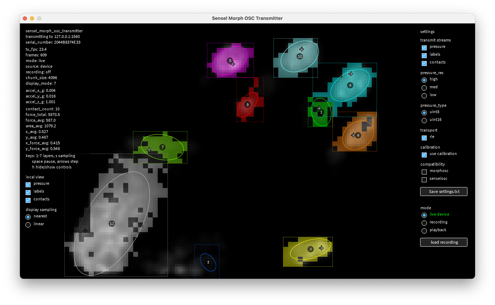

# Processing Apps for Sensel Morph


---

## Overview

This folder contains six Processing utilities for viewing, transmitting, calibrating, recording
and replaying data from the Sensel Morph touchpad. Open each app by launching the `.pde` file inside its same-named folder: 

* [**OSC_Transmitter**](sensel_morph_osc_transmitter/README.md)
* [**OSC_Receiver**](sensel_morph_osc_receiver/)
* [**Syphon+OSC_Transmitter**](sensel_morph_syphon_osc_transmitter/README.md)
* [**Websocket_Transmitter**](sensel_morph_websocket_transmitter/README.md)
* [**Capture_Viewer**](sensel_morph_capture_viewer/README.md)
* [**OSC_Calibrator**](sensel_morph_osc_calibrator/README.md) 


All of the apps are known to work in MacOS 15.6 with [Processing 4.5.5](https://github.com/processing/processing4/releases#release-processing-1433-4.5.5) (June 24, 2026) — **except** for the Syphon+OSC Transmitter, which is known to work with [Processing 4.3](https://github.com/processing/processing4/releases?page=3#release-processing-1293-4.3). These apps use Processing's [Serial Library](https://processing.org/reference/libraries/serial/index.html) for USB CDC register I/O and native Java UDP code for OSC; they do not depend on `oscP5`, the Sensel SDK, or any of the Python code in this repository.

### Summary of Processing Apps for Sensel Morph

| Processing App | Primary use | Receives | Sends / Publishes | Notes |
|---|---|---|---|---|
| [**OSC_Transmitter**](sensel_morph_osc_transmitter/) | Standalone live device-to-OSC transmitter with local display, calibration, raw recording, and replay. | Receives raw Morph frames over USB CDC | Emits OSC over UDP on (default) port `1560`; a [Processing OSC receiver](sensel_morph_osc_receiver/) is provided. Also able to save `.jsonl` recordings. | Best starting point for OSC workflows. Uses native Java UDP, not `oscP5`. A useful bridge to many other apps. |
| [**OSC_Receiver**](sensel_morph_osc_receiver/) | Live OSC monitor/viewer. | Receives OSC from one of the Processing transmitters, or from the provided Python tool | Nothing; display-only. | Displays pressure, labels, contacts, and other data. Useful for checking transmitter output. |
| [**Syphon+OSC_Transmitter**](sensel_morph_syphon_osc_transmitter/) | Standalone live transmitter for audiovisual tools such as TouchDesigner. | Receives raw Morph frames over USB CDC | Emits OSC over UDP, *and* Syphon image buffers for the Morph's pressure, labels, and contact information. A [sample TouchDesigner receiver](../touchdesigner/) is provided. Also able to save `.jsonl` recordings. | Requires the Processing Syphon library. **NOTE:** Our known-good local setup used **Processing 4.3** because of Syphon's native-library architecture constraints. |
| [**Websocket_Transmitter**](sensel_morph_websocket_transmitter/) | Standalone live device-to-WebSocket transmitter for browser/p5.js clients. | Receives raw Morph frames over USB CDC | Emits device data via a WebSocket server, default `ws://127.0.0.1:1561`. [Sample p5.js WebSocket receivers](../p5js/) are provided. Also able to save `.jsonl` recordings. | Similar to the OSC transmitter, but publishes the data over the WebSocket protocol. |
| [**Capture_Viewer**](sensel_morph_capture_viewer/) | Offline recording viewer. | Loads `.jsonl` or `.json` recordings created with one of the Processing transmitters | Nothing; display only. | Uses the same display/decoding logic as the transmitters. |
| [**OSC_Calibrator**](sensel_morph_osc_calibrator/) | Builds optional pressure calibration files to compensate for fixed noise patterns. | Receives `uint16` pressure OSC from one of the Processing transmitters. | Exports calibration `.json` files used in the Processing transmitters. | Should be run with an OSC transmitter sending `185 x 105`, `uint16` pressure. |

Note that the Syphon+OSC transmitter app additionally requires the Processing Syphon library
(`codeanticode.syphon.*`) and publishes three Syphon image buffers: `Sensel Morph Pressure`,
`Sensel Morph Labels`, and `Sensel Morph Contacts`. Its pressure buffer defaults
to bicubic shader interpolation for prettier graphics output; label buffers are
always displayed nearest-neighbor so label IDs remain discrete.

---

### Common Controls



The transmitter/viewer sketches share a similar display model and keypress register:

- `1`-`7`: choose local pressure/labels/contacts layer combinations.
- `s`: toggle pressure display sampling where available.
- `p`: save pressure, labels, and contacts screenshots where available.
- Spacebar: pause/resume recording playback.
- Left/Right arrows: step frames while playback is paused.
- `h`: hide/show HUD and controls.

The UI can change streams, resolution, pressure type,
RLE, calibration, compatibility modes, and display sampling while the app is
running. Calibration is offered only when a matching
`data/calibration_<serial_number>.json` file exists. Stream and format changes
briefly reconfigure device scanning without restarting the Processing sketch.
The `Save settings.txt` button writes the current UI values to
`data/settings.txt`, as discussed in the next section.

---

## Settings Files 

Each sketch loads a tab-separated `data/settings.txt`, which can also be updated from the in-sketch UI.

```text
host	127.0.0.1
port	1560
pressure	true
pressure_res	med
pressure_type	uint8
labels	true
contacts	true
rle	true
compat	
```

Supported settings include `device`, `serial_number`, `pressure`,
`pressure_res` (`high`, `med`, `low`), `pressure_type` (`uint8`, `uint16`),
`use_calibration`, `labels`, `contacts`, `rle`, `chunk_size`, `compat`
(`morphosc`, `senselosc`, or both), `force_scale`, `fps_limit`,
`read_timeout_ms`, and `accel_counts_per_g`. Accelerometer data is always
requested and transmitted.


---

### Glossary of Protocols Used Here

These apps use the following protocols: 

- **USB CDC serial**: used by the three transmitter sketches to receive data directly
  from the Morph and decode its raw pressure, label, contact, and accelerometer frames.
- **OSC**: used for local UDP communication with Processing, Max, TouchDesigner,
  and other media tools. The native address family is `/sensel_morph/...`.
- **WebSocket**: used for browser clients, especially the included p5.js
  receivers.
- **Syphon**: MacOS graphics-buffer publishing for video tools. Only the
  Syphon+OSC transmitter uses it.

---