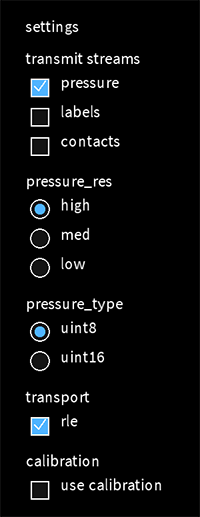

# sensel_morph_osc_calibrator

## Overview

`sensel_morph_osc_calibrator` is a Processing sketch that builds
per-pixel calibration maps for the Sensel Morph's `185 × 105` pressure
image.

Its purpose is to compensate for persistent sensor-element variation:
pressure pixels that consistently respond too strongly or too weakly
regardless of the gesture passing over them.

The sketch **does not communicate directly with the Sensel Morph**.
Instead, it receives live pressure frames over OSC from any of the following transmitter apps in this repository: 

* `sensel_morph_osc_transmitter` (Processing)
* `sensel_morph_syphon_osc_transmitter` (Processing)
* `sensel_morph_osc` (Python)

Conceptually, this is the pressure-sensor analogue of camera
**flat-field correction**, **dark-frame subtraction**, and
**fixed-pattern noise** calibration. The mathematics is essentially
identical: estimate stable per-pixel offsets and gain differences, then
compensate them during acquisition.

---

## Quick Start

Start an OSC transmitter. This could be the `sensel_morph_osc_transmitter` or `sensel_morph_syphon_osc_transmitter` Processing sketch, or it could be the provided Python program, `sensel_morph_osc`:

``` sh
sensel_morph_osc --pressure --pressure-res high --pressure-type uint16
```

If you use one of the Processing OSC transmitters, be sure to set its settings as follows, and as shown below: 

* transmit streams: **pressure enabled**
* pressure res (resolution): **high** 
* pressure type (bit depth): **uint16** 
* transport (commmunication speed): **rle enabled** 
* calibration: **disabled**



Be sure that `calibration` is unchecked! Otherwise your calibration may be compensating for another calibration file. 

Then open:

``` text
processing/sensel_morph_osc_calibrator/sensel_morph_osc_calibrator.pde
```

The sketch listens on UDP port `1560`, matching the default transmitter
configuration.

------------------------------------------------------------------------

## Calibration Workflow

### Controls

```
  Key         Function
  ----------- --------------------------------------------
  `0`         Capture a 10-second dark/no-touch baseline
  `1`--`9`    Select one of nine brush-pass slots
  Space       Clear the current slot
  Return      Compute calibration and save files
  `+` / `-`   Adjust coverage threshold
  `h`         Toggle HUD
```

### Procedure

1.  Capture a 10-second no-touch baseline (`0`).
2.  Perform broad, even brush passes using slots `1`--`9`.
3.  Vary brush direction between passes when possible.
4.  Press Return to compute and save the calibration.

Perfect coverage is unnecessary. Pixels never exceeding the coverage
threshold remain uncalibrated and receive gain `1.0`.

### HUD

The HUD displays:

-   `current_max`: highest pressure value in the current frame.
-   `scene_global_max`: highest accumulated value in the selected scene.

---

## Calibration Algorithm

The dark slot stores an averaged no-touch pressure image.

Each brush-pass slot stores a per-pixel maximum:

``` text
pass_max[pixel] = max(pass_max[pixel], incoming_pressure[pixel])
```

When Return is pressed:

1.  Dark map subtraction.
2.  Threshold uncovered pixels.
3.  Aggregate brush passes using the statistic controlled by
    `CALIBRATION_MIDDLE_COUNT`.
4.  Compute the global median target response.
5.  Compute gain:

``` text
gain = target / pixel_value
```

6.  Clamp gains to `0.5–2.0`.
7.  Leave uncovered pixels at gain `1.0`.

The default configuration averages the middle five brush-pass values,
providing robustness against unusually weak or strong passes.

Coverage threshold is estimated automatically from the dark capture:

``` text
coverage_threshold = max(bit_depth_floor, dark_noise_p99 * 3)
```

where the floor is:

-   `1` for `uint8`
-   `8` for `uint16`

Manual adjustment remains available using `+` and `-`.

The calibration model follows conventional imaging practice:

``` text
corrected = (raw - dark) * gain
gain[pixel] = target / (flat[pixel] - dark[pixel])
```

For the Morph:

``` text
corrected_pressure[pixel] =
    max(0, raw_pressure[pixel] - dark_offset[pixel]) * gain[pixel]

gain[pixel] =
    target_response / measured_brush_response[pixel]
```

The dark preview is displayed on an absolute pressure scale rather than
normalized per image.

---

## Output Files

Calibrations are written to

``` text
processing/sensel_morph_osc_calibrator/calibrations/<timestamp>/
```

Generated files include:

-   `dark_185x105_u16.tif`
-   `pass_XX_max_185x105_u16.tif`
-   `light_dark_subtracted_185x105_u16.tif`
-   `gain_185x105_u16_gain32768.tif`
-   `coverage_mask_185x105_u16.tif`
-   `gain_185x105_f32.tif`
-   `gain_185x105_f32.pfm`
-   `calibration_<serial>.json`

The TIFF writer is implemented directly in Processing without ImageIO
plugins. Files are uncompressed little-endian grayscale TIFFs;
floating-point TIFFs use `SampleFormat=IEEEFP`.

The JSON, TIFF metadata, and PFM header all store the detected device
serial number. Calibrations tagged `unknown` or with mismatched serial
numbers are rejected by `sensel_morph_osc`.

Raw brush-pass maxima are intentionally preserved so calibrations can
later be recomputed using different thresholds, statistics, or gain
limits.

---

## Applying a Calibration

The transmitter applications apply the calibration before expanding the compressed
sensor grid whenever a calibration contains a light map:

``` text
source_dark, source_gain = kernel_fit(...)
corrected_source = max(0, raw_source - source_dark) * source_gain
corrected_185x105 = sensel_4tap_expand(corrected_source)
```

Use:

``` sh
sensel_morph_osc --calibration calibration_<serial>.json
```

to enable live correction.


---

## Calibration Theory

This procedure is adapted from standard imaging calibration practice,
translated from cameras to the Morph pressure sensor.

Relevant concepts include:

-   [Flat-field
    correction](https://en.wikipedia.org/wiki/Flat-field_correction) is
    the general idea: compensate pixel-to-pixel gain differences so a
    uniform input produces a uniform output. The same practice commonly
    uses per-pixel gain plus dark/bias correction, and multiple flat
    frames can be combined to reject non-persistent artifacts.
-   [Dark-frame
    subtraction](https://en.wikipedia.org/wiki/Dark-frame_subtraction)
    is the matching offset/noise-floor idea: capture the sensor with no
    external signal, then subtract that baseline.
-   [Fixed-pattern
    noise](https://en.wikipedia.org/wiki/Fixed-pattern_noise) is the
    visible persistent pattern we are trying to suppress. The relevant
    camera concepts are dark-signal non-uniformity for offsets and
    photo-response non-uniformity for gain differences: temporally
    stable pixel variation under the same stimulus.
-   [Photo-response
    non-uniformity](https://en.wikipedia.org/wiki/Photo_response_non-uniformity)
    describes the per-pixel sensitivity differences that make different
    sensor cells respond differently to the same input. High-end and
    metrology cameras often apply a 2D correction-factor table for this.
-   [TIFF](https://en.wikipedia.org/wiki/TIFF) is appropriate for
    calibration maps because it supports arbitrary bit depths and, via
    extension tags, IEEE-754 floating-point samples.
-   [Netpbm / PFM](https://en.wikipedia.org/wiki/Netpbm) documents PFM
    as an unofficial four-byte IEEE 754 single-precision floating-point
    image format; `Pf` is the grayscale form.

The Morph-specific compromise is that we cannot easily apply a truly
uniform pressure field to the whole surface at once. The brush-pass
method approximates a flat field by moving a locally uniform stripe
across the sensor, accumulating each pixel's best observed response, and
using multiple passes plus a median to reduce gesture/coverage
artifacts.
