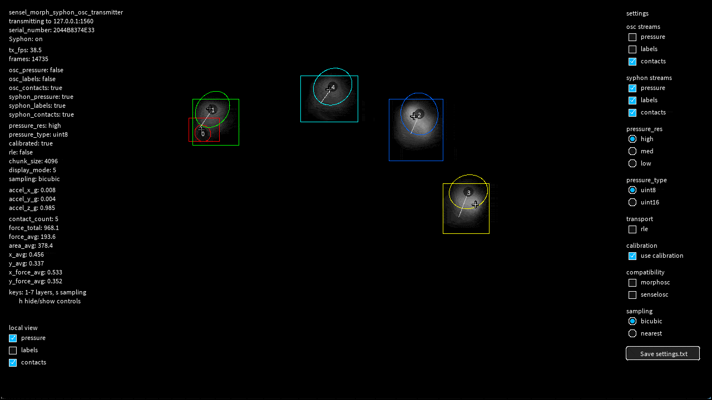

# sensel_morph_syphon_osc_transmitter

**ALERT: Known to be compatible with Processing 4.3**

*Using this [Processing 4.3](https://github.com/processing/processing4/releases/tag/processing-1293-4.3) sketch, you can transmit the Sensel Morph pressure image to other apps on your computer, such as [TouchDesigner](https://derivative.ca/UserGuide/Syphon_Spout_In_TOP), using [Syphon](https://syphon.info/). The sketch also sends Sensel Morph data over OSC.*

---

## Overview

This directory presents a Processing 4.3 sketch that connects directly to the Sensel Morph over USB CDC (Communications Device Class) serial; decodes live
pressure, label, contact, and accelerometer information; and then emits both OSC data and Syphon graphics buffers for use in macOS software such as TouchDesigner. The sketch publishes up to three different graphics buffers over Syphon:

- `Sensel Morph Pressure`
- `Sensel Morph Labels`
- `Sensel Morph Contacts`

It uses native Java UDP for OSC and does not require `oscP5`, Python, or the Sensel SDK. It does require the [Processing Syphon library](https://github.com/Syphon/Processing) (`codeanticode.syphon.*`), which you can install using the Processing Contribution Manager (*Sketch > Import Library > Manage Libraries*).

The `Sensel Morph Pressure` Syphon buffer defaults
to bicubic shader interpolation for prettier graphics output. On the other hand, the `Sensel Morph Labels` buffer is always displayed with nearest-neighbor interpolation so label IDs remain discrete.

The sketch also supports recording and playback of Sensel Morph interactioms. 

---

## Instructions

Open `sensel_morph_syphon_osc_transmitter.pde` in Processing and run it. The
sketch loads its tab-separated settings from `data/settings.txt`.

The right-side UI controls OSC stream selection, Syphon stream selection,
resolution, pressure type, RLE, calibration, compatibility modes, and
live/record/playback mode. The left-side `local view` controls only the
Processing canvas preview. Use `Save settings.txt` to persist the current UI
state.

---

## More Information 

**Architecture note**: the Syphon Processing library includes native code. Its
`libJSyphon.jnilib` must match the Processing JVM architecture. An Intel
`x86_64` Syphon library will not load in an Apple Silicon `arm64` Processing
app. Use a universal/arm64 Syphon library with arm64 Processing, or run an
x86_64 Processing build (such as version 4.3) under Rosetta.

Observed locally: with the installed Intel-only Syphon 4.0 library, the sketch
runs in Processing 4.3 (`x86_64`). Processing 4.5.5 (`arm64`) can only run the OSC
parts of the sketch, and cannot load the installed Syphon native library.

Settings are loaded from `data/settings.txt`, with the same tab-separated keys
as `sensel_morph_osc_transmitter`, plus `syphon_pressure`, `syphon_labels`, and
`syphon_contacts`. A matching `data/calibration_<serial_number>.json` file
enables the `use calibration` checkbox and the `c` key.

This sketch separates stream selection into two groups:

* OSC streams sent over UDP: 
  - `pressure`, `labels`, `contacts`
* Graphics buffers published as Syphon sources: 
  - `syphon_pressure`, `syphon_labels`, `syphon_contacts`

The Sensel hardware is configured to capture the union of those choices. For
example, you can set `contacts true` and `pressure false` for OSC while keeping
`syphon_pressure true` if you want pressure available only as a Syphon texture.
When a Syphon stream checkbox is off, the app publishes a transparent blank
frame for that stream so receivers do not keep displaying stale data.
When contacts are enabled and pressure plus labels are already being captured
for OSC or Syphon output, the app uses fresh label-mask raster-derived contact
ellipses, bounding boxes, and peaks. With pressure plus contacts but no labels,
it uses the hybrid pressure+bbox ellipse path for isolated contacts and falls
back to firmware ellipses for overlaps. Contacts-only mode remains lightweight
and uses the firmware contact geometry.

Pressure Syphon output defaults to bicubic shader interpolation. Labels are
always rendered nearest-neighbor so label IDs remain visually discrete.
The optional `display_sampling` setting accepts `bicubic` or `nearest`;
legacy/copied values of `linear` are interpreted as `bicubic` in this Syphon
sketch.
The `local_view` setting controls only the Processing canvas preview as a
bitmask: pressure = `1`, labels = `2`, contacts = `4`, and combinations use
their sum, so `7` shows all three.

To avoid a startup flicker seen in some Syphon receivers when the pressure
buffer starts directly in bicubic shader mode, the pressure output is forced
through nearest-neighbor sampling for the first 60 rendered pressure frames.
After that warmup, the configured `display_sampling` mode takes over.

On sketch exit, the app sends one transparent blank frame to each Syphon server,
then unregisters and stops those servers. This reduces stale 1280x720 black
streams persisting in clients such as TouchDesigner after the Processing sketch
has quit.

## Raw Recording and Replay

Choose `recording` in the right-side mode controls to write raw Morph frame
packets to JSONL files in `data/recordings/`. Switch back to `live device` to
stop recording and save the file. These recordings store raw packets before
calibration and output formatting, so pressure decoding, calibration, ellipse
fitting, OSC packing, and Syphon rendering are recomputed during replay.

Choose `playback` to replay the newest recording in `data/recordings/`, or use
`load recording` to select another file. Playback works without a connected
Morph, loops by default, and shows a 10-pixel progress bar along the bottom of
the canvas. During playback, stream checkboxes only change what is transmitted
or published; they do not restart the recording.

If playback is paused, the current frame continues to be retransmitted and
republished. This lets OSC and Syphon receivers continue to see fresh data for
the held frame instead of a silent stream.

---

## Key Commands:

- `1`: view pressure only
- `2`: view labels only
- `3`: view pressure + labels
- `4`: view contacts only
- `5`: view pressure + contacts
- `6`: view labels + contacts
- `7`: view all layers
- `s`: cycle pressure display sampling: bicubic, nearest
- `c`: toggle calibration, when a matching calibration file is available
- `p`: save `screenshots/sensel_<frameCount>_pressure.png`,
  `screenshots/sensel_<frameCount>_labels.png`, and
  `screenshots/sensel_<frameCount>_contacts.png`
- Spacebar: pause/resume playback when `source` is `recording`
- Left/Right arrows: while playback is paused, step backward/forward by one
  recorded frame, wrapping around the recording boundaries
- `R`: toggle between live device capture and recording playback
- `h`: toggle HUD and right-side settings UI
